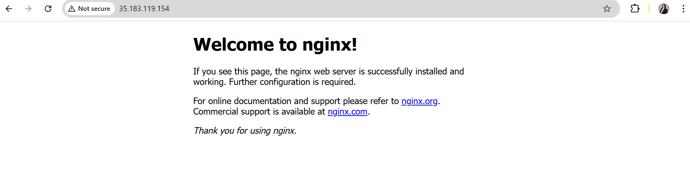
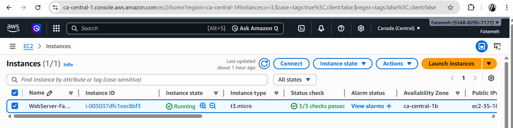
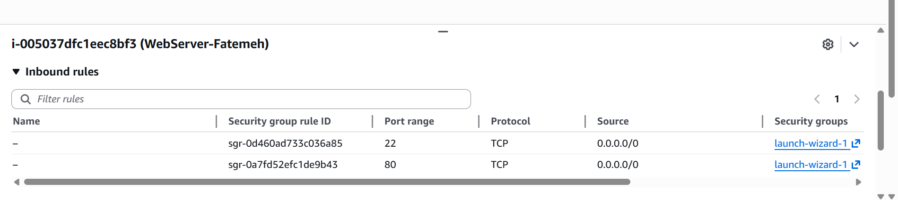

# Fatemeh Feyzipour – Cloud Portfolio ☁️

## About Me
I am a cloud computing learner, building hands-on projects with Amazon Web Services (AWS).  
My goal is to gain practical cloud skills and create real-world solutions.

---

## Skills
- AWS Cloud Fundamentals
- Amazon EC2
- Amazon S3
- IAM Security
- Cloud Networking

---

## Projects

### 1. Static Website Hosting on AWS
**Description:** Hosted a static website using S3.  
**Live demo:** [View Website](http://fatemeh-cloud-portfolio.s3-website.ca-central-1.amazonaws.com) 
**Screenshots:**

### 2. EC2 Web Server Deployment
**Description:** Launched an EC2 instance with Nginx to serve web content.  
**Screenshots:**
- 
- 

### 3. IAM Security Setup
**Description:** Configured IAM users, roles, and policies for secure access.  
**Screenshot:** 

### 4. Architecture Diagram
**Description:** Cloud architecture of deployed projects.  
**Screenshot:** 

---

## Contact
- LinkedIn: https://www.linkedin.com/in/fatemeh-feyzipour
- GitHub: https://github.com/fatemehfeizipour

---
